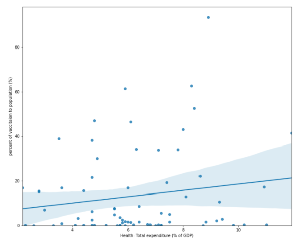

# An investigation on the factors that contribute to global inequitable access to the Covid-19 vaccination
## Technologies and resource
- Python 3.6
- Analysis libraries: numpy, pandas
- Visualization libraries: matplotlib, seaborn, plotly (interactive visualization)
- Author: Wendy Ha
- Datasets: [Our World in Data](https://github.com/owid/covid-19-data), [Duke Global Health Innovation Centre](https://sdgstoday.org/dataset/covid-19-vaccine-procurement), [UN Data](https://www.kaggle.com/sudalairajkumar/undata-country-profiles )
- Notebook with details coding: [https://colab.research.google.com/drive/1_y5MCmAptpWYK-XxzziXwRSCJXfWTyX3?usp=sharing](https://colab.research.google.com/drive/17LTS_td83AOCK4S_4gBwj3AaX5FNX87Y?usp=sharing)
## Background and motivation
In relation with the development of COVID-19 vaccines by the end of 2020, WHO partnered with UNICEF to introduce COVAX, a programme aimed at encouraging equal vaccine distribution in all countries, in which the wealthier nations commit to donating vaccine doses to poor ones (WHO Vaccine Equity 2020).
 
 
COVAX was an idealistic initiative. This project's first goal was to provide 1.4 billion vaccination doses to middle - low and low - income nations by the end of 2021 (WHO Vaccine Equity 2020). However, after COVAX was launched, it was difficult to guarantee that vaccines will be equally distributed over the world. 
 
 
According to data updated to September 2021 in Gavi - The Vaccine Alliance organization, barely 40% of the initial aim has been met (COVAX Global Supply Forecast 2021). On the other hand, the gap in vaccination coverage between rich and poor nations is significant (Nancy 2021). Most residents in rich countries are completely vaccinated; for example, 83.5 percent of Australians aged 16 and over are twice vaccinated, compared to 68.5 percent in the United Kingdom and 75.5 percent in Canada (Nancy 2021). In contrast, less than 1% of people in impoverished nations such as Tanzania, Chad, and Haiti have got their first dose of vaccination (Nancy 2021). 
 
 
**"The global ideal of equitable access to COVID-19 immunizations is unlikely to come true,"** a COVAX official sadly conclude in a statement (Ducharme 2021).
## Objectives
This research will undertake a thorough analysis on the issues that impacted the inefficiency in COVAX's acceleration by combining COVID-19 data sets from [Our World in Data](https://github.com/owid/covid-19-data), [Duke Global Health Innovation Centre](https://sdgstoday.org/dataset/covid-19-vaccine-procurement) and [UN Data](https://www.kaggle.com/sudalairajkumar/undata-country-profiles ) with data visualization methodologies.
 
 
The report specifically seeks to answer the following questions:
- **How does the disparity in vaccination progress occur in terms of nation and region?**
- **What factors have contributed to inequity in worldwide access to Covid vaccines?**
- **How population, economic and quality of healthcare system impact vaccine distribution throughout the world?**

At the end, the purpose of this research is to provide some valuable insights into the parameters controlling COVID-19 vaccine worldwide distribution. Based on this, the COVAX's officials may refer to and optimize their approach for more efficient deployment.
## PART 1: Geographic Analysis
Bar charts and Choropleth map illustrate the vaccination progress between regions in the world
### Q1: What are the top biggest countries with vaccinations progress ?

### Q2: What are the top lowest countries with vaccinations progress ?

### Q3: What are the highest and lowest vaccination progress by continents?

### Findings:
#### High income countries in Eastern and Southern Asia, Northern and South America, and Western Europe are among the first to vaccinate their citizens
> Eastern and Southern Asia (represented by China and the United Arab Emirates (UAE)), Northern and South America (represented by the United States and Canada), and Western Europe (represented by the United Kingdom and European Union countries) have the highest proportion of people who have received at least one dose of COVID-19 vaccine. In fact, approximately 90 percent of the UAE population is completely vaccinated (has gotten two doses of the vaccine), whereas the ratio is 80 percent in Spain, 77 percent in Canada and China, and 69 percent in the United Kingdom.

> All of the wealthy countries have all manufactured their own vaccines and have a robust economy. That is why they have such significant immunisation rates. The next demographic analysis will give an in-depth evaluation of the economic and social factors that have influenced vaccination timeline between these countries in comparison to the rest of the world.

#### Northern Europe and Central America, which constitute the majority of upper-middle and middle- income nations, are experiencing slower progress, but they are still on plan.
> Russia, a country in Northern Europe, has developed its own vaccine Sputnik V, which has a 92 percent success rate in preventing COVID-19 (Hart 2021). This vaccine has been used in the national immunisation programme from August 2020 (Hart 2021). Despite the fact that Russia's initial development lags behind that of the wealthy nations, with only 44 percent of people receiving the first dose and 37 percent receiving the second dose before until November 2021, the government expects to accelerate the progress and completely vaccinate the entire country by mid-2022, at the same time as developed countries.

> Other Central American countries, such as Mexico and Brazil, have signed agreements with global pharmaceutical companies like Pfizer and BioNTech to host production facilities and perform clinical trials in their countries. This allows them to provide immunizations to individuals on the front lines and the most vulnerable people faster and at a lower cost. However, other elements like population size, public health infrastructure, number of health care workers, and political factors all have affect their ability to deliver broad immunisation. As a result in Fig.5, Mexico reported 59 percent of its population vaccinated against COVID-19 in September 2021, whereas Brazil achieved 77 percent.

#### Almost the entire continent of Africa, including the number of low-income countries, is still unvaccinated. 
> Overall, many poor African nations are unable to vaccinate their citizens. By the statistic updated to November 2021, the proportion of immunised persons in low-income nations is around 3 percent. Only 2.7 percent of the Sudanese population has received one shot, whereas 2.9 percent in Papua New Guinea.

## PART 2: Demographic Analysis
### Q1: What are the demographic factors influence the vaccination rate?
Heat Map visualize relationship among vaccination rate with demographic factors

> The heatmap above revealed that the **total population, GDP per capita,** and **percentage of GDP spent on health** all have a positive correlation with total vaccination. As a result, they are identified as main demographic factors influencing vaccination progress.

### Q2: How population impact to vaccination progress and vaccine worldwide distribution?
The COVID-19 vaccines have been pre-ordered in greater than the real need of many wealthy countries

> The size of the population certainly has an impact on both the rate of distribution and the coverage of the covid vaccination. Examples include China and India, which together account for 40% of the world's population. Despite having the advantage of manufacturing its own vaccine since the end of 2020, the deployment of vaccination campaign in both nations has been delayed due to high population density. Only 77 percent of Chinese citizens had got two doses of the vaccine as of November 2021. In India, the number is much lower, at only 22%.

> On the other side, the size of the population also influences the situation in which rich nations (high-income and upper middle-incom) order an excess of vaccines, resulting in a scarcity of vaccine supplies for poor nations in Figure 8.  
> The EU, for example, has pre-ordered 1.6 billion COVID-19 vaccine shots for its just 375 million adult population. If all requests are satisfied and after the entire population is fully immunized, they will have up to 525 million doses of vaccine left over. This amount may have saved the lives of several residents in developing nations.

### Q3: How economic power impact to vaccination progress and vaccine worldwide distribution?
Positive correlation between vaccination rates with GDP

Purchasing power between countries caused by economic prosperity

> The economic status strongly influence on immunisation rates of a country. It is shown in the Figure 10 that nations with a high GDP per capita will be able to pre-order and develop their own vaccinations, while ones with a low GDP completely lose their competitive advantage in early vaccines access race.

> In 2020, several high- and upper-middle-income nations with advantages in infrastructure, technology, and finance sources invested in domestic vaccine manufacture and production capacity. As a result, numerous wealthier countries have obtained large supplies of vaccines, allowing them to vaccinate their populations multiple times (Access to COVID-19 vaccines: Global approaches in a global crisis 2021). Furthermore, high-income countries can afford to pay higher average prices per dose than low- and middle-income countries, which may explain why they are always stay to the front of the queue of drug makers (Access to COVID-19 vaccines: Global approaches in a global crisis 2021).

### Q4: How Health Expenditure impact to vaccination progress and vaccine worldwide distribution?
Positive correlation between vaccination rates with Health expenditure

> Not only health expenditures and vaccination rates are associated; a positive correlation between GDP and total health expenditure was found through Figure 7 also. When a country's economy is performing well, the amount of money it spends on health care as a percentage of its GDP rises. As a consequence, they were able to create a sustainable resource with healthcare professionals, medical facilities, and equipment on standby to respond quickly to any unanticipated worldwide disaster, such as COVID-19, with the least amount of damage.

> In contrast to high-income countries, African countries are not prepared to receive and handle huge amounts of vaccination yet.    
> Because to the low economic conditions, there are few health facilities and healthcare workers that can handle truly critical illnesses. Furthermore, all of the necessary equipments, for instance oxygen machines and ICU facilities, are in limited supply. To be able to accelerate the vaccination process, many impoverished nations require additional assistance from international organisations and specialists, not just in terms of vaccine supply.

